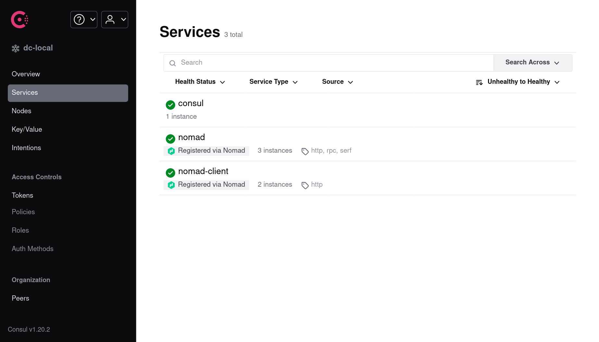
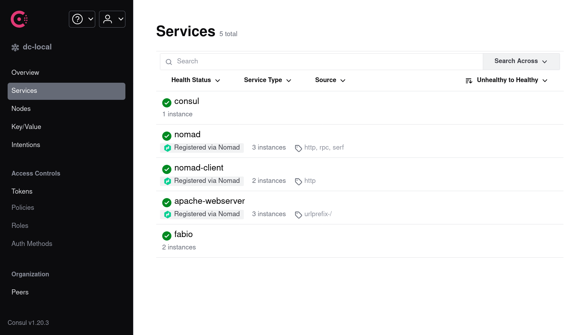

# Hashilab 

## Description 

[HashiCorp](https://www.hashicorp.com/) (HC) offers a suite of tools that are sometimes collectively called 
[HashiStack](https://www.hashicorp.com/resources/how-we-used-the-hashistack-to-transform-the-world-of-roblox). While HC tools have great [tutorials](https://learn.hashicorp.com/), instructions to set them up together in a local cluster are [not easy](https://discuss.hashicorp.com/t/local-nomad-cluster-using-vagrant/33067) to come by.

This project contains tooling to set up a local HashiStack cluster using the following tools:

1. [Vagrant](https://www.vagrantup.com/) (used to manage local Virtual Machines using [VirtualBox](https://www.virtualbox.org/))
2. [Ansible](https://www.ansible.com/) (install and configure necessary software in the VMs)

Ansible is one of the many [provisioners](https://www.vagrantup.com/docs/provisioning) supported by Vagrant. I've 
used Ansible because:

1. I've used Ansible before
2. I like the idea of idempotent scripts

## Caveats

* This project assumes that you are running Ubuntu OS locally
* This project has only been tested on Ubuntu 20.04
* Local Virtual Machines (VM) are configured to use Ubuntu 20.04 
  * You can change this by tweaking the [Vagrantfile](/Vagrantfile).  

## Instructions 

1. Install software necessary for bootstrapping the cluster. This will install Vagrant, VirtualBox, Python 3.9, and 
   Ansible. You can skip this step these are already available in your machine. 
   1. Please go through [`prerequisites.sh`](/prerequisites.sh) and verify that it is not doing anything unsafe 
   2. Installation requires your `sudo` password - please keep it ready

   ```shell
   hashilab$ ./prerequisites.sh
   ```

3. Install the [`vagrant-docker-compose`](https://github.com/leighmcculloch/vagrant-docker-compose) plugin, used to 
   install Docker in all VMs. This plugin will be installed locally inside the project repository.    

    ```shell
    hashilab$ vagrant plugin install vagrant-docker-compose
    # Installing the 'vagrant-docker-compose' plugin. This can take a few minutes...
    ```

4. Bring up the VMs. Vagrant will invoke Ansible to set up and configure the necessary software the first time this 
   is done. This will take a few minutes (~15 in my experience) depending on your machine and network speed.

    ```shell
    hashilab$ vagrant up
    # Bringing machine 'server' up with 'virtualbox' provider...
    # Bringing machine 'client1' up with 'virtualbox' provider...
    # Bringing machine 'client2' up with 'virtualbox' provider...
    # ...
    ```

## Verifying 
    
If everything goes well you should be able to see the following:

1. Three VMs running in VirtualBox. These will be named:
   1. `server`
   2. `client1` and
   3. `client2` respectively
2. Consul up and running at [http://localhost:8500/ui/](http://localhost:8500/ui/)
3. Nomad up and running at [http://localhost:4646/ui/](http://localhost:4646/ui/)

### Screenshots

#### Consul



#### Nomad


## Troubleshooting 

You can SSH into the machines as follows:

 ```shell
 hashilab$ vagrant ssh <machine-name>
 ```

For e.g. to access `server` VM:

 ```shell
 hashilab$ vagrant ssh server
 ```

Both Consul and Nomad are set up to run as services, using `systemd`. 
Check their status and logs to see if the services started properly:

 ```shell
hashilab$ vagrant ssh server
# After SSH into one of the VMs 
 
vagrant@server:~$ systemctl status consul
● consul.service - Consul Startup process
   Loaded: loaded (/etc/systemd/system/consul.service; enabled; vendor preset: enabled)
   Active: active (running) since Tue 2022-03-08 22:35:03 IST; 19min ago
 Main PID: 17486 (consul)
    Tasks: 8 (limit: 2314)
   CGroup: /system.slice/consul.service

vagrant@server:~$ systemctl status nomad
● nomad.service - Nomad Startup process
   Loaded: loaded (/etc/systemd/system/nomad.service; enabled; vendor preset: enabled)
   Active: active (running) since Tue 2022-03-08 22:36:22 IST; 18min ago
 Main PID: 18413 (nomad)
    Tasks: 9 (limit: 2314)
   CGroup: /system.slice/nomad.service
           └─18413 /usr/bin/nomad agent -config /etc/nomad.d/

vagrant@server:~$ journalctl -u consul
-- Logs begin at Tue 2022-03-08 22:29:26 IST, end at Tue 2022-03-08 22:54:51 IST. --
Mar 08 22:35:03 server systemd[1]: Started Consul Startup process.
Mar 08 22:35:03 server consul[17486]: 2022-03-08T22:35:03.813+0530 [WARN]  agent: skipping file /etc/consul.d/consul.env, extension must be .hcl or .jso
Mar 08 22:35:03 server consul[17486]: 2022-03-08T22:35:03.815+0530 [WARN]  agent: skipping file /etc/consul.d/consul.hcl.17325.2022-03-08@22:35:01~, ext
Mar 08 22:35:03 server consul[17486]: 2022-03-08T22:35:03.815+0530 [WARN]  agent: The 'ui' field is deprecated. Use the 'ui_config.enabled' field instea
Mar 08 22:35:03 server consul[17486]: 2022-03-08T22:35:03.815+0530 [WARN]  agent: BootstrapExpect is set to 1; this is the same as Bootstrap mode.
Mar 08 22:35:03 server consul[17486]: 2022-03-08T22:35:03.816+0530 [WARN]  agent: bootstrap = true: do not enable unless necessary
Mar 08 22:35:03 server consul[17486]: 2022-03-08T22:35:03.816+0530 [WARN]  agent: using

vagrant@server:~$ journalctl -u nomad
-- Logs begin at Tue 2022-03-08 22:29:26 IST, end at Tue 2022-03-08 22:55:13 IST. --
Mar 08 22:36:22 server systemd[1]: Started Nomad Startup process.
Mar 08 22:36:22 server bash[18413]: ==> WARNING: Bootstrap mode enabled! Potentially unsafe operation.
Mar 08 22:36:22 server bash[18413]: ==> Loaded configuration from /etc/nomad.d/nomad.hcl
Mar 08 22:36:22 server bash[18413]: ==> Starting Nomad agent...
 ```

## Configuration

Consul, and Nomad **server** configurations generated after provisioning are given below.

### Consul

This file is located at `/etc/consul.d/consul.hcl` in the `server` VM.

```hcl
# NOTE: `ansible_eth1` because `eth1` is the name of the interface created via Vagrant
bind_addr            = "172.20.20.10"
data_dir             = "/var/consul"
datacenter           = "dc-local"
enable_script_checks = true
enable_syslog        = true
leave_on_terminate   = true
log_level            = "DEBUG"
node_name            = "server"
# // @formatter:off
retry_join           = ["172.20.20.10", "172.20.20.21", "172.20.20.22"]
# // @formatter:on

# // @formatter:off
bootstrap_expect    = 1
client_addr         = "0.0.0.0"
server              = true
ui                  = true
# // @formatter:on
```

### Nomad

This file is located at `/etc/consul.d/nomad.hcl` in the `server` VM.

```hcl
# Ref: https://learn.hashicorp.com/tutorials/nomad/clustering
# NOTE: Bind to `0.0.0.0` to make UI accessible from host
bind_addr  = "0.0.0.0"
data_dir   = "/var/nomad"
datacenter = "dc-local"

advertise {
  http = "172.20.20.10"
  rpc  = "172.20.20.10"
  serf = "172.20.20.10"
}

server {
  enabled          = true
  bootstrap_expect = 1
}

ui {
  enabled = true
}
```

## Running Jobs

Refer to the [examples](examples/) directory to see some sample jobs. You can run them using Nomad as described below.

### Example 1: Load Balancing with Fabio

1. SSH into the `server` VM

   ```shell
   hashilab$ vagrant ssh server
   ```

2. Vagrant shares the directory where `Vagrantfile` is located with all VMs as `/vagrant` inside the VMs. The
   `examples` directory can therefore be found at `/vagrant/examples` inside `server`. To run a specific [example](https://learn.hashicorp.com/tutorials/nomad/load-balancing-fabio)
   navigate to the appropriate child directory inside `examples`:

   ```shell
   vagrant@server:~$ cd /vagrant/examples/01_load_balancing_with_fabio/
   ```

3. Submit the `fabio.nomad` job:

   ```shell
   vagrant@server:/vagrant/examples/01_..._fabio$ nomad job run fabio.nomad
   ```

4. Submit the `webserver.nomad` job:

   ```shell
   vagrant@server:/vagrant/examples/01_..._fabio$ nomad job run webserver.nomad
   ```

5. If everything goes well you should be able to see the jobs running in the Nomad UI as shown in the screenshot
   below.

#### Screenshots

##### Nomad


##### Consul



## Code

This project has tooling to set up two HashiStack tools: Consul, and Nomad. I'll add more as I go along. Take a look at the issues, and pull requests to see the process.

The following files will help you understand how the cluster is set up.

1. Review the Vagrantfile. This file describes/controls the following:
   1. How the VMs are created, network is configured etc.
   2. How to install Docker using `vagrant-docker-compose`
   3. How to use Ansible to install other HC software in the VMs after they start
2. Review [playbooks/hashilab.yml](playbooks/hashilab.yml), and [playbooks/roles/hashilab/tasks/main.yml](playbooks/roles/hashilab/tasks/main.yml)
   1. These describe what software should be installed, and how they should be configured